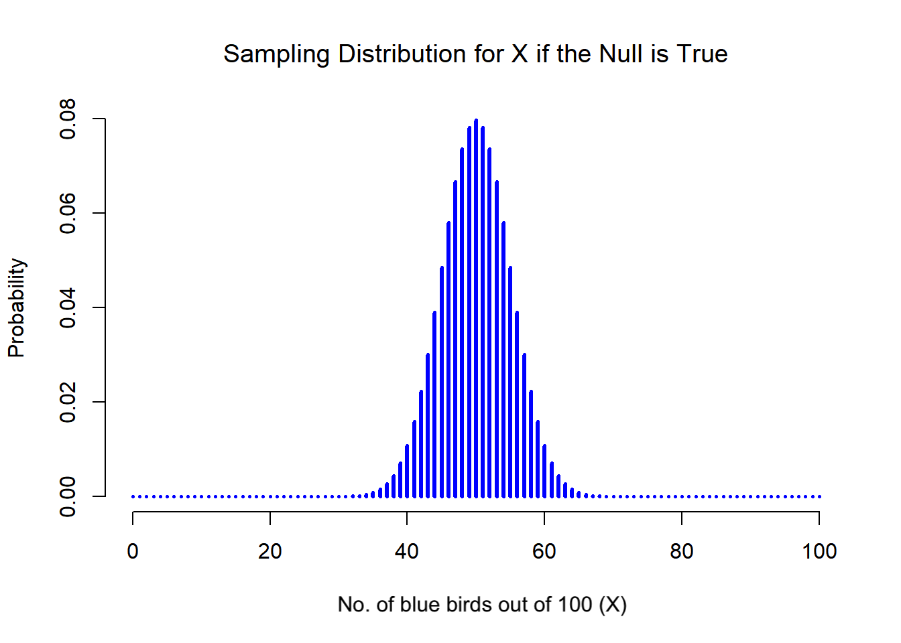
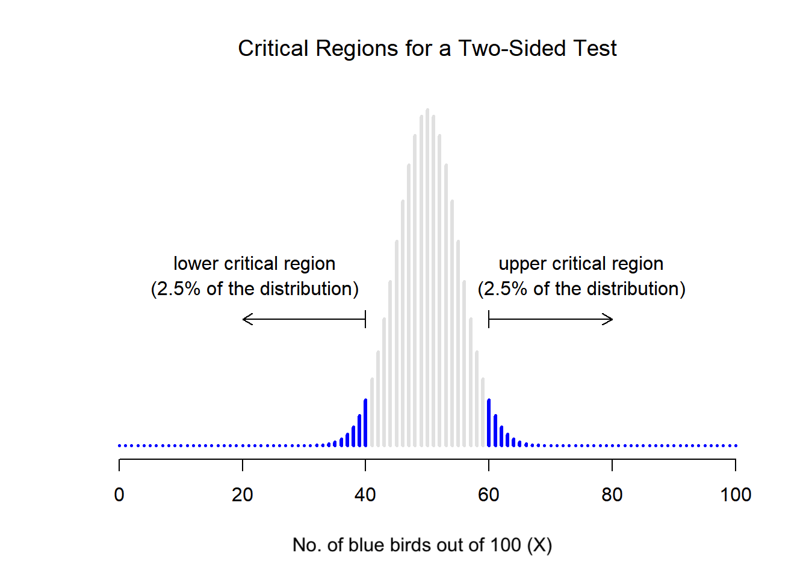
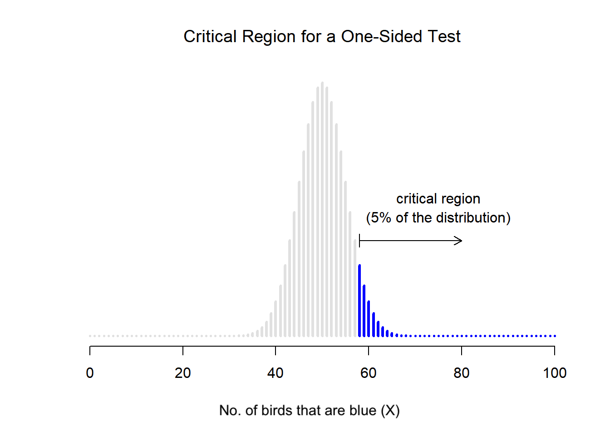
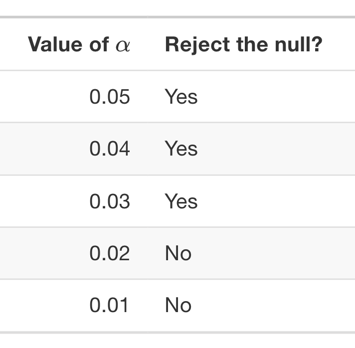

```{r setup, include=FALSE}
options(htmltools.dir.version = FALSE)
knitr::opts_chunk$set(
  fig.width=9, fig.height=3.5, fig.retina=3,
  out.width = "100%",
  cache = FALSE,
  echo = TRUE,
  message = FALSE, 
  warning = FALSE,
  hiline = TRUE
)

#library(xaringanExtra)
#xaringanExtra::use_panelset()
```

```{r xaringan-themer, include=FALSE, warning=FALSE}
library(xaringanthemer)
style_duo_accent(
  primary_color = "#FF3C38", #headers
  secondary_color = "#006C67", #bold inline #011936
  inverse_header_color = "#FFB100", #FFFFFF
  colors = c(red = "#FF3C38",
           grey = "#003844",
           blue = "#1F85DE"),
  #text_font_size = "1.1rem"
)
```

class: title-slide center middle
background-image: url("hands.png")
background-position: right
background-size: contain
background-color: white

.pull-left[
# .red[`r rmarkdown::metadata$title`]

### .red[`r rmarkdown::metadata$author`]

### .red[`r rmarkdown::metadata$date`]
]

---

# Today

<br>

```{css, echo=F}
    /* Table width = 100% max-width */

    .remark-slide table{
        width: 100%;
    }

    /* Change the background color to white for shaded rows (even rows) */

    .remark-slide thead, .remark-slide tr:nth-child(2n) {
        background-color: white;
    }
    
    
```

.pull-left[
```{r, echo = FALSE}
library(kableExtra)
dt <- data.frame(schedule = c("Course introduction",
                              "Group exercise: mini reading group", #30-45 mins
                              "Break (15 mins)", #15 mins 11:00
                              "Introduction to hypothesis testing", #45 min lecture 12:00
                              "Lunch (45 mins)", # 45 mins  13:00
                              "Group exercise: defining hypotheses", #30 minutes
                              "(Re)Introduction to the normal distribution"),
                 start.time = c("10:00", 
                          "", 
                          "", 
                          "11:00", 
                          "12.00",
                          "13:00",
                          "13:30")) #45 minutes
kbl(dt, align=c("l","c")) %>%
  kable_styling(bootstrap_options = "striped", full_width = F, position = "left")

# Slides
```
.footnote[Times are approximate.]
]

--

.pull-right[
<center></center>
]

---

class: middle

```{css, echo=F}
   .large { font-size: 120% }
```

# About this course

.large[
The course focuses on statistical **hypothesis testing** and **reproducibility** in science. 

You will learn:
* how develop and test your own hypotheses
* perform basic statistical tests 
* apply this knowledge to reproduce (and potentially improve) published results.
]

.large[Each participant is assigned to a working and each group is assigned a published scientific paper.]

---

.left-column[


<br>
<br>

.red[
## Group 1
]

<br>
<br>
<br>
<br>
<br>

.red[
## Group 2
]

]

.right-column[

<br>
<br>

.large[
[*Isotopic and anatomical evidence of an herbivorous diet in the Early Tertiary giant bird Gastornis*](https://pubmed.ncbi.nlm.nih.gov/24563098/)
]

* Lars (online?)
* Nida
* Toshiro

<br>
<br>

.large[
[*High coral diversity is coupled with reef-building capacity during the Late Oligocene warming*](https://riviste.unimi.it/index.php/RIPS/article/view/16332)
]

* Bastian
* Taeya

]


---

<br>
<br>
<br>
<br>

# Course evaluation

.large[The goal is to reproduce the results of a published scientific article.]

--

.large[On **Friday afternoon** each group will present their findings.]

--

.large[You can use this [*Google Slides Template*](https://docs.google.com/presentation/d/1R_p1v3kD2eWrfU0uOmbvyE4iP0YD2_KRqfAuxwOLSMg/edit?usp=sharing) to prepare your presentation.]

--

.large[Within your working groups, try to do everything within time allocated for the course.]

---
<br>
<br>
<br>
<br>

# Will I have to use R?

--

.large[Not necessarily.]

--

.large[The focus of the is on the **concepts** behind hypothesis testing and reproducibility, not programming, although both things are easier if you use R.]

--

.large[It's up to each group how you divide the tasks.]

---
class: middle inverse

.pull-left[

<br>
<br>

.center[
## I'm here all week to help!
]

]


.pull-right[
<center></center>
]

---

background-image: url("fully-expecting.jpeg")
background-size: contain
class: middle

--


```{r, echo=FALSE}
#--
# Many students don't enjoy learning about statistics $-$ I know, because I used to be one!
# I hope not
```
---

<br>
<br>
<br>

# Why study statistics?

.large[
* Humans are **biased**.
]

--

.large[
* Science is **complicated** and data is **messy**.
]

--

.large[
* It is deeply intertwined with **research design**.
]

--

.large[
* It makes the **literature** more accessible, since many papers you encounter will include statistics.
]

--

.large[
* Where there's **data** there's statistics!
]

--

.large[
* Having some statistical knowledge gives you a **superpower** &#x1F9B8;
]

```{r echo=FALSE}
# We need to be able to build trust in our discoveries.
# Messy data - perhaps especially in paleo?
# Results can be unexpected or counter intuitive
```

---
class: middle

.pull-left[
```{r out.width = '100%', echo = FALSE}
# local
knitr::include_graphics("fossil.png")
```
]

.pull-right[
# Why does palaeobiology feature so much statistics?
.large[What do you think? &#129300;]
]


```{r echo=FALSE}
# The data are messy
# We can't re-observe the past
# There aren't universal truths, like there are in physics
```

---
class: middle
# Mini reading group

.pull-left[
.large[**First group exercise**]

In your working groups:

Introduce yourselves and discuss your paper.
* What is the paper about?
* What was the general aim?
* Did you like / not like it?

To report back: prepare a three sentence summary.

]

--

.pull-right[
```{r echo=FALSE}
countdown::countdown(
  minutes = 15, 
  seconds = 0, 
  warn_when = 120, 
  style = "position: relative; width: min-content; margin: 1em auto;",
  #color_running_background = "#31b09e",
  color_warning_background = "#f79334",
  #color_finished_background = "#b56b6f",
  #color_finished_text = "#eaeaea"
)
```
]

---
class: middle center


<center></center>

# .black[Time for a break]


---
class: middle
background-image: url("noahs-ark.jpg")
background-size: contain
background-position: right

.pull-left[
# Introduction to hypothesis testing</p>
]

---
background-image: url("noahs-ark.jpg")
background-size: contain
background-position: right

<br>
<br>
<br>

.pull-left[
# Objectives

.large[
* Statistical hypotheses

* Null vs. alternative hypotheses

* Type I and type II erros

* Significance and *p*-values
]

.footnote[Further reading [*Learning Statistics with R*](https://learningstatisticswithr.com/book/)]

]

---

<br>
<br>
<br>

# Hypothesis testing

.large[At its core, hypothesis testing is a simple idea] $-$ .large[you, the researcher, have some theory about how the world works, and want to determine whether or not available data support your theory.]

--

.large[A **research hypothesis** involves make a substantive*, testable scientific claim.]

.footnote[*having a firm basis in reality]

```{r, echo = FALSE}
# --
# .large[In practice, this can be be tricky.]
```

---

## Some examples of research hypotheses

.large[&#x1F3B5; **Listening to music reduces your ability to concentrate on other things**] $-$ .large[this is a claim about the causal relationship between two psychologically meaningful concepts (listening to music and paying attention to things). This is a reasonable scientific hypothesis.]

--

.large[&#129504; **Intelligence is related to personality**] $-$ .large[this is another relation claim, this time about two psychological constructs (intelligence and personality). The claim is weaker because it proposes correlation not causation.]

--

.large[&#129504; **Intelligence is the speed of information processing**] $-$ .large[this is not a relation claim, it's an ontological claim about the definition of intelligence. This is a research questions, but it's usually more straightforward to ask *"does X affect y?"* than *"what is X?"*.]

--

.large[Most everyday research questions tend to be relational.]


.footnote[Examples [*Learning Statistics with R*](https://learningstatisticswithr.com/book/hypothesistesting.html#hypotheses)]
---
class: middle

.pull-left[
```{r out.width = '100%', echo = FALSE}
# local
knitr::include_graphics("fossil.png")
```
]

.pull-right[

<br>
<br>

## What are examples of research hypotheses in palaeobiology? 

]

```{r, echo=FALSE}
### &#129429; &#127758; &#128296; &#x1F469;&#x200D;&#x1F4BB;
```

---
## Examples of statements that are **not** research hypotheses

.large[**Love is a battlefield**] $-$ .large[too vague to be testable. A research hypothesis can be vague to some extent, but you have to be able to break into down into testable theories. This statement can't be converted into a concrete research design.]

--

.large[**The first rule of tautology* club is the first rule of tautology club.**] $-$ .large[this is by definition true. Your hypotheses must have the possibility of being wrong!]

--

.large[**More people in my experiment will say "yes" than say "no"**] $-$ .large[this is a claim about the data, not about a scientific theory. This hypothesis actually sounds more like a statistical hypothesis.]

.footnote[Examples [*Learning Statistics with R*](https://learningstatisticswithr.com/book/hypothesistesting.html#hypotheses)

tautology = saying the same thing twice in different words
]

---
<br>
<br>
<br>

## Research vs. statistical hypotheses

.large[So to recap, a **research hypothesis** involves make a substantive, testable scientific claim, i.e., has a firm basis in reality.]

--

.large[Sometimes a research hypothesis can be a bit fuzzy, but ultimately research hypotheses are scientific claims.]

--

.large[In contrast, a **statistical hypothesis** must be mathematically precise and must correspond to specific claims about the data generating mechanism (i.e., the underlying population).]

---
background-image: url("blue-bird.png")
background-size: contain
background-size: 15%
background-position: 90% 10%

<br>
<br>

## Statistical hypothesis example

<br>
<br>

.large[
Say we have a species of bird and the birds can be either **.blue[blue]** or **.red[red]**. We want to know, does being blue confer some advantage?

* Birds have the same chance of being blue as being red.

* More birds are blue.

* More birds are red.
]

---
background-image: url("blue-bird.png")
background-size: contain
background-size: 15%
background-position: 90% 10%

<br>
<br>

## Statistical hypothesis example

.large[
Evidence for this might come from the numbers for each color.

$\theta$ = the probability of being .blue[blue].

* Birds have the same chance of being .blue[blue] as being .red[red]. If this is true, then $\theta=$ 0.5.

* More birds are .blue[blue]. If this is true, $\theta >$ 0.5.

* More birds are .red[red]. If this is true, $\theta <$ 0.5.

* If I know a different number of birds are blue than are red, but I didn’t keep my field notes well organised, I might not know which way round the numbers go. Then, $\theta \neq$ 0.5.
]

---
background-image: url("blue-bird.png")
background-size: contain
background-size: 15%
background-position: 90% 10%

<br>
<br>

## Statistical hypothesis example

<br>
<br>

.large[
These examples are **statistical hypotheses** because they are statements about a 'population' parameter and are meaningfully relevant to the research hypothesis.

Research hypothesis: being blue is better. Statistical hypothesis: $\theta >$ 0.5. 

A statistical (hypothesis) test is a *test* of the statistical hypothesis, not the research hypothesis.
]

---
class: middle

## Null vs. alternative hypotheses 

.large[
The **null hypothesis** $H_0$ corresponds to the exact opposite of the thing I want to believe.

The thing I'm actually interested in is the **alternative hypothesis** $H_1$.

In our example, the null hypothesis is $\theta =$ 0.5, since that's what we'd except if there was no advantage of being blue. The alternative is $\theta >$ 0.5.

The goal is not to show that the alternative hypothesis is (probably) true, the goal is to show that the null hypothesis is (probably) false.
]

```{r, echo=FALSE}
#the null hypothesis is deemed to be true unless you, the researcher, can prove beyond a reasonable doubt that it is false.
```
---
class: middle
# Hypotheses

.pull-left[
.large[**Second group exercise**]

Discuss the hypotheses in your paper.

Try to identify the following:
* The research hypothesis
* The alternative hypothesis
* The null hypothesis

Make a note to add your presentation.
Don't worry about getting it perfect, you can go back and refine it later.

If your paper includes more than one, just pick one.

]

.pull-right[
```{r echo=FALSE}
countdown::countdown(
  minutes = 10, 
  seconds = 0, 
  warn_when = 8, 
  style = "position: relative; width: min-content; margin: 1em auto;",
  #color_running_background = "#31b09e",
  color_warning_background = "#f79334",
  #color_finished_background = "#b56b6f",
  #color_finished_text = "#eaeaea"
)
```
]

---
<br>
<br>
<br>

## Two types of errors

.large[
If we flip a coin 10 times and all 10 times we get heads, this is pretty strong evidence that our coin is biased. But there's a 1 in 1024 chance that this would happen even if the coin was fair.]

--

.large[
We **always** have to accept there's a chance that the results of any experiment are wrong.]

--

.large[
The goal behind statistical hypothesis testing is not to *eliminate* but to *minimize* errors.
]

---
<br>
<br>
<br>

## Two types of errors

.large[
After we run the test, one of four things might have happened:

* $H_0$ is true $-$ correct decision

* $H_0$ is true $-$ incorrect decision (type I error)

* $H_0$ is false $-$ correct decision

* $H_0$ is false $-$ incorrect decision (type II error)
]

---
<br>
<br>
<br>

## Two types of errors

.large[
If we reject a null hypothesis that is actually true, then we have a **type I error**.

If we retain the null hypothesis that is actually false, then we have a **type II error**.]

--

.large[
One of the most important design principles of hypothesis testing is to control the probability $\alpha$ of a **type I error**. $\alpha$ is called the significance level. By convention we often use $\alpha$ of 0.05, 0.01, 0.001.]

--

.large[
A hypothesis test that is said to have a significance level $\alpha$ has a type I error rate is no larger than $\alpha$.
]

---
<br>
<br>
<br>

## Two types of errors

<br>

.large[
What about type II error rate? We care about this probability $\beta$ too. We refer to the **power** of the test, which is the probability that we reject the null hypothesis when it really is false, which is $1 - \beta$. A powerful test has a small value of $\beta$. Note we don't have a corresponding level for $\beta$.]

--

<br>

.large[
Statistical tests are designed to minimise $\alpha$, not $\beta$.
]

---
background-image: url("blue-bird.png")
background-size: contain
background-size: 15%
background-position: 90% 10%

<br>
<br>
<br>

## Sampling distributions

<br>

.large[
If the probability of being a .blue[blue] bird is $\theta = 0.5$, what would we expect the data to look like?]

--

.large[
We can also say $X/N = 0.5$ (approximately). This is our **test statistic**.] 

--

.large[
We need to determine what the **sampling distribution of the test statistic** would be if the null hypothesis was true. This distribution tells us what values we can expect if $H_0$ is true. We use this a tool for assessing how closely the null agrees with our data.
]

---

class: middle

<center></center>

The null hypothesis predicts that $X$ is [*binomially distributed*](https://en.wikipedia.org/wiki/Binomial_distribution).
It says $X = 50/100$ is the most likely outcome, so we'd expect to see somewhere between 40 and 60 .blue[blue] birds.

---
class: middle

## Critical regions and critical values

.large[
$X$ should be very big or very small in order to reject the null hypothesis. 

If the null hypothesis is true, the sampling distribution of $X$ is Binomial $(0.5, N)$.

If $\alpha = 0.05$, the critical region must cover 5% of this sampling distribution.
]

---
class: middle center

<center></center>

Our critical region consists of the most extreme values, known as the **tails** of the distribution.

---
class: middle

.pull-left[

<br>
<br>
<br>

.large[
The **critical region** corresponds to the values of $X$ for which we would reject the null hypothesis, while the **sampling distribution** describes the probability that we would obtain a particular value of $X$ if the null hypothesis were actually true.
]
]

.pull.right[

]

---
class: middle

.pull-left[

.large[
For $\alpha =$ .05, our critical regions correspond to  $X ≤$ 40 and $X≥$ 60.

The numbers 40 and 60 are our **critical values**.

If the number of blue birds is between 41 and 59, then we should retain the null hypothesis (birds have the same chance of being .blue[blue] as being .red[red]).

If the number of blue birds is between 0 to 40 **or** between 60 to 100, then we should reject the null hypothesis $-$ this is a **two tailed test**.
]
]

.pull.right[

]


---
class: middle center

<center></center>

The critical region for a **one sided test**. We would use this to test for $\theta >$ 0.5 (i.e, more birds are .blue[blue]).

---
class: middle
## Statisical significance

.large[
If the data allow us to reject the null hypothesis, we say that "the result is statistically significant", which is often shortened to "the result is significant". 

This terminology reflects a time when "significant" meant something like "indicated", rather than its more recent meaning, which is closer to "important".
]

---
# *p-values*

.pull-left[

.large[
*p* can be defined to be the smallest type I error rate $\alpha$ that you are willing to tolerate if you want to reject the null hypothesis.

In the bird example, $X=$ 62 .blue[blue] birds gives us 
*p* = 0.021. The results can be interpreted as shown in the table, given *p* = 0.021.

$X=$ 97 .blue[blue] birds would give us *p* = 1.36 X $10^{-25}$, which is a tiny, tiny type I error rate.
]

.footnote[*p* can be calculated in R or looked up in a statistical table.]

]

.pull-right[
<center></center>
]

---
# *p-values*

.pull-left[

.large[

Recall that the critical region corresponds to the tails (extremes) of the distribution. 

*p* can therefore also be defined as the probability of observing a test statistic that is (at least) as extreme as the one we actually get. 

If the data are extremely implausible according to the null hypothesis, then the null hypothesis is probably wrong.

]

.footnote[*p* can be calculated in R or looked up in a statistical table.]

]

.pull.right[

]


---
class: middle
# Reporting *p-values*

.large[
**Option 1** $-$ you can state only that *p* $< \alpha$ for a significance level that you chose in advance, e.g., *p<*.05.

But this means we're being forced to treat *p*=.051 in a fundamentally different way to *p*=.049.]

--

.large[
**Option 2** $-$ just report the actual *p* value and let the reader make up their own minds about what an acceptable type I error rate is.

But if you get *p=*.062, then it means that you have to be willing to tolerate a type I error rate of 6.2% to justify rejecting the null. If you personally find 6.2% intolerable, then you retain the null.
]


---
class: middle
# Intepreting *p*-values

.pull-left[
.large[**Third group exercise**]

How have the authors in your paper interpreted the *p* values?

Spend 15 minutes putting together the 'Scientific background' and 'Hypothesis' slides.
]

.pull-right[
```{r echo=FALSE}
countdown::countdown(
  minutes = 15, 
  seconds = 0, 
  warn_when = 12, 
  style = "position: relative; width: min-content; margin: 1em auto;",
  #color_running_background = "#31b09e",
  color_warning_background = "#f79334",
  #color_finished_background = "#b56b6f",
  #color_finished_text = "#eaeaea"
)
```
]

---

class: middle center


<center></center>

# .black[Time for a break]

