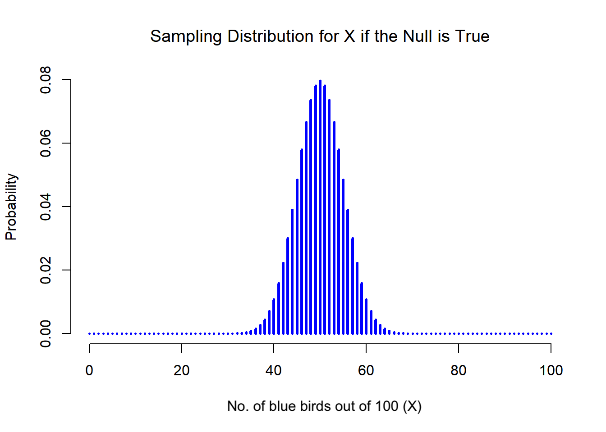
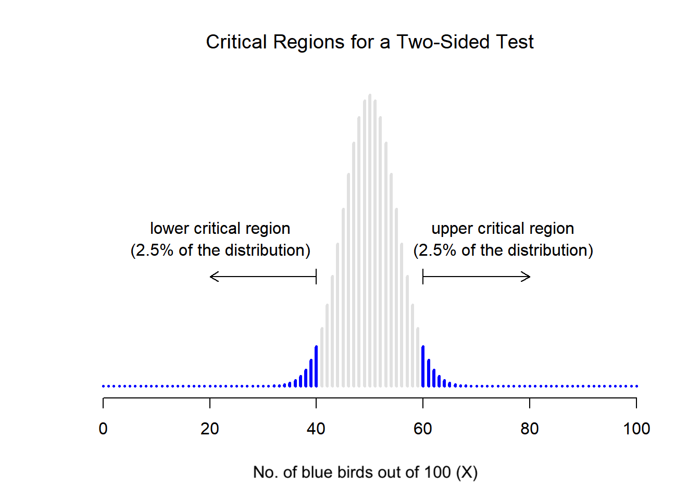
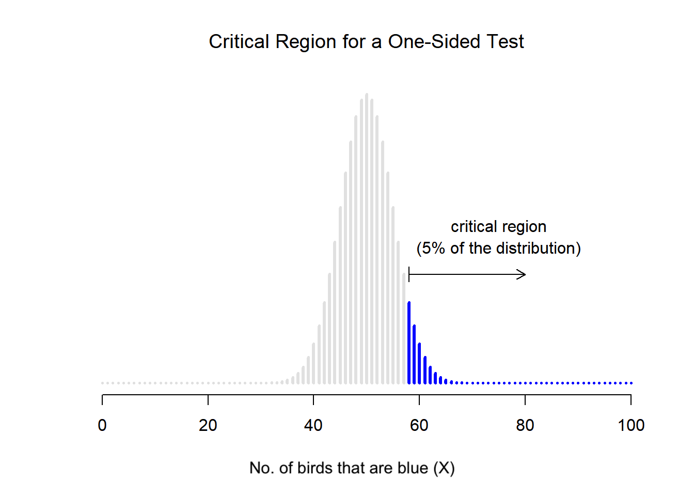
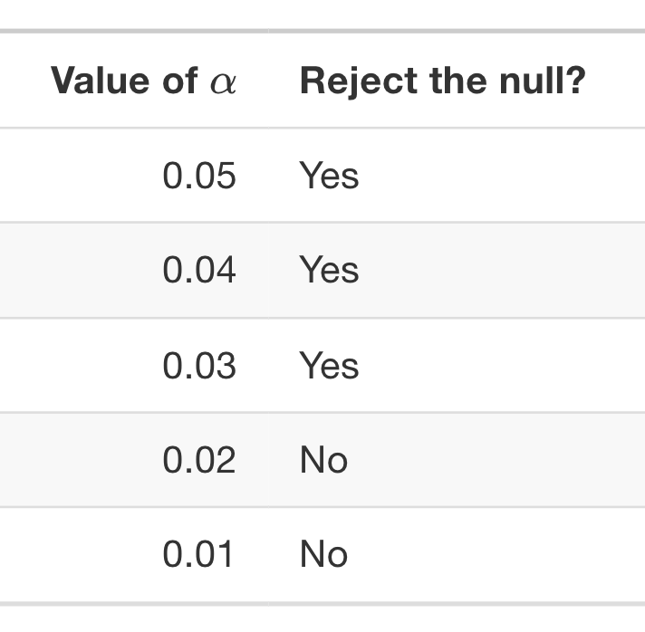

```{r, include=FALSE} 
#setup
options(htmltools.dir.version = FALSE)
knitr::opts_chunk$set(
  fig.width=9, fig.height=3.5, fig.retina=3,
  out.width = "100%",
  cache = FALSE,
  echo = TRUE,
  message = FALSE, 
  warning = FALSE,
  hiline = TRUE
)

#library(xaringanExtra)
#xaringanExtra::use_panelset()
```

```{r, include=FALSE, warning=FALSE} 
#xaringan-themer
library(xaringanthemer)
style_duo_accent(
  primary_color = "#FF3C38", #headers
  secondary_color = "#006C67", #bold inline #011936
  inverse_header_color = "#FFB100", #FFFFFF
  colors = c(red = "#FF3C38",
           grey = "#003844",
           blue = "#1F85DE"),
  #text_font_size = "1.1rem"
)
```

class: title-slide center middle
background-image: url("img/hands.png")
background-position: right
background-size: contain
background-color: white

.pull-left[
# .red[`r rmarkdown::metadata$title`]

### .red[`r rmarkdown::metadata$author`]

### .red[`r rmarkdown::metadata$date`]
]

---

# Today

<br>

```{css, echo=F}
    /* Table width = 100% max-width */

    .remark-slide table{
        width: 100%;
    }

    /* Change the background color to white for shaded rows (even rows) */

    .remark-slide thead, .remark-slide tr:nth-child(2n) {
        background-color: white;
    }
    
```

.pull-left[
```{r, echo = FALSE}
#schedule
library(kableExtra)
dt <- data.frame(schedule = c( # variables quiz
                              "Course introduction", #20 mins
                              "Group exercise: mini reading group", #20 mins
                              "Break",
                              "Introduction to hypothesis testing", #45 min lecture 12:00
                              "Group exercise: defining hypotheses", #30 minutes
                              "Lunch (1 hr)", # 45 mins  13:00
                              "P-values"),
                 start.time = c("10:00", 
                          "", 
                          "", 
                          "11:15", 
                          "12.30",
                          "13:30",
                          "14:00")) #45 minutes
kbl(dt, align=c("l","c")) %>%
  kable_styling(bootstrap_options = "striped", full_width = F, position = "left")

# Slides
```
.footnote[*times are approximate]
]

--

.pull-right[
<center></center>
]

---

class: middle

```{css, echo=F}
   .large { font-size: 120% }
```

# About this course

.large[
The course focuses on **statistical hypothesis testing** and **reproducibility** in science. 

You will learn:
* how develop and test your own hypotheses
* perform basic statistical tests 
* apply this knowledge to reproduce (and potentially improve) published results
]

.large[Each participant is assigned to a working and each group is assigned a published scientific paper.]

---

.left-column[


<br>
<br>

.red[
## Group 1
]

<br>
<br>


.red[
## Group 2
]

<br>

.red[
## Group 3
]

]

.right-column[

<br>
<br>

.large[
[*Statistical analysis of iron geochemical data suggests limited late Proterozoic oxygenation*](https://www.nature.com/articles/nature14589)
]

<br>
<br>

.large[
[*High coral diversity is coupled with reef-building capacity during the Late Oligocene warming*](https://riviste.unimi.it/index.php/RIPS/article/view/16332)
]

<br>
<br>

.large[
[*Isotopic and anatomical evidence of an herbivorous diet in the Early Tertiary giant bird Gastornis*](https://pubmed.ncbi.nlm.nih.gov/24563098/)
]

]


---

<br>
<br>
<br>
<br>

# Course evaluation

.large[The goal is to reproduce the results of a published scientific article.]

--

.large[On **a date to be decided** each group will present their findings.]

--

.large[You can use this [*Google Slides Template*](https://docs.google.com/presentation/d/1R_p1v3kD2eWrfU0uOmbvyE4iP0YD2_KRqfAuxwOLSMg/edit?usp=sharing) to prepare your presentation.]

--

.large[Within your working groups, try to do everything within time allocated for the course.]

---
<br>
<br>
<br>
<br>

# Will I have to use R?

--

.large[Not necessarily.]

--

.large[The focus of the course is on the **concepts** behind statistical hypothesis testing and reproducibility, not programming, but both things are (probably) easier if you use R.]

--

.large[It's up to each group how you divide the tasks.]

---

background-image: url("img/fully-expecting.jpeg")
background-size: contain
class: middle


```{r, echo=FALSE}
#--
# Many students don't enjoy learning about statistics $-$ I know, because I used to be one!
# I hope not
```

---
class: middle inverse

.pull-left[

<br>
<br>

.center[
## I'm here to help!
]

]


.pull-right[
<center></center>
]

---
class: middle

.pull-left[
```{r, out.width = '100%', echo = FALSE}
# local
knitr::include_graphics("img/fossil.png")
```
]

.pull-right[
# Why does palaeobiology feature so much statistics?
.large[What do you think? &#129300;]
]


```{r, echo=FALSE}
#.large[
#* Why is it not sufficient just to have a research objective or question? 
#* Why can't we just collect observations and describe those in our papers?
#]
```
```{css, echo=F}
    .my-one-page-font {
      font-size: 35px;
      color: darkslategray;
    }
```
---
class:my-one-page-font

```{r, out.width = '15%', fig.align = 'right', echo = FALSE}
# local

```

*"Statistics is the discipline that concerns the collection, organization, analysis, interpretation, and presentation of data."*

---

<br>
<br>
<br>

# Why study statistics?

.large[
* Humans are **biased**
]

--

.large[
* Living systems are **complicated** and data is **messy** (maybe especially in paleo)
]

--

.large[
* It is deeply intertwined with **research design**
]

--

.large[
* Where there's **data** there's statistics!
]

--

.large[
* It makes the **literature** more accessible, since many papers you encounter will include statistics
]

--

.large[
* Having some knowledge of statistics gives you a **superpower** &#x1F9B8;
]

```{r, echo=FALSE}
# We need to be able to build trust in our discoveries
# There aren't universal truths, like there are in physics
# Results can be unexpected or counter intuitive
```
---
class: middle
# Mini reading group

.pull-left[
.large[**First group exercise**]

In your working groups:

Introduce yourselves and discuss your paper.
* What is the paper about?
* What was the general aim?
* Did you like / not like it?

To report back: prepare a three sentence summary.

]

.pull-right[
```{r, echo=FALSE}
countdown::countdown(
  minutes = 20, 
  seconds = 0, 
  warn_when = 120, 
  style = "position: relative; width: min-content; margin: 1em auto;",
  #color_running_background = "#31b09e",
  color_warning_background = "#f79334",
  #color_finished_background = "#b56b6f",
  #color_finished_text = "#eaeaea"
)
```
]
---
class: middle center

<center></center>

# .black[Time for a break]


---
class: middle
background-image: url("img/noahs-ark.jpg")
background-size: contain
background-position: right
name: hypothesis

.pull-left[
# Introduction<br> to statistical<br> hypothesis<br> testing</p>

]

---
background-image: url("img/noahs-ark.jpg")
background-size: contain
background-position: right

<br>
<br>
<br>

.pull-left[
# Objectives

.large[
* Research hypotheses

* Statistical hypotheses

* Null vs. alternative hypotheses

* Significance and *p*-values
]

.footnote[Further reading [*Learning Statistics with R*](https://learningstatisticswithr.com/book/)]

]

---
background-image: url("img/moons.png")
background-size: contain
background-position: right

<br>
<br>
<br>

# Hypotheses

.pull-left[
.large[A hypothesis is an explanation for an observed phenomenon.]

.large[It involves making a substantive*, testable scientific claim.]

<br>
<br>
<br>
<br>

.small[*it must have a firm basis in reality]

.small[Right: [Galileo's sketches](https://www.metmuseum.org/art/collection/search/778099) of the moon from 1610]

]

```{r, echo=FALSE}
# A central tool in science since the 1600s
# 1609 Galileo looked at the Moon using a telescope
# Was the first to deduce the cause of the uneven waning of light was from lunar mountains and craters
```
---
class: middle
background-image: url("img/Platt.png")
background-size: contain
background-position: right

.pull-left[
# Hypothesis testing

.large[
The scientific method in 3 steps:

1. Develop alternative hypotheses

2. Devise experiments to eliminate all but one hypothesis

3. Perform the experiments
]


.footnote[[Platt (1964)](https://www.science.org/doi/10.1126/science.146.3642.347)]
]
---
<br>
<br>
<br>

# Benefits of hypothesis driven research

.footnote[[Platt (1964)](https://www.science.org/doi/10.1126/science.146.3642.347)]

.large[Reduces chances that researchers become attached to a single outcome and design tests on this basis (confirmation bias).]

--

.large[
Forces us to design tests in advance of seeing the data, rather than explaining patterns we observe later (inductive research).
]

--

.large[It has positive impacts on reproducibility.]

---

<br>
<br>
<br>

# Research hypotheses

.large[A **research question** is any question that a research project sets out to answer.]

.large[A **research hypothesis** provides an explanation for an observed phenomenon.]

.large[The research hypothesis can include the potential mechanism or cause of a phenomenon and used to make predictions.]

---

<br>
<br>
<br>

# Example

.large[
**Research question** $-$ What is the impact of continental configuration on extinction risk?]

.large[
**Research hypothesis** $-$ Extinction intensity during the Ordovician will be higher than the Cenozoic because less species are able to disperse along continental margins.]

---
class: bottom
background-image: url("img/continents.png")
background-size: 85%
background-position: center


.small[[Saupe et al. 2019](https://www.nature.com/articles/s41561-019-0504-6)]

---
<br>
<br>
<br>

# Example

.large[
**Research question** $-$ How does body size affect diversification potential among mammals following the K-Pg extinction?]

.large[
**Research hypothesis** $-$ Large mammals will undergo more diversification relative to other body size categories through expansion into larger body size niches previously occupied by dinosaurs (the dinosaur incumbency hypothesis).]


```{css, echo=F}

.my-style {
  font-size: .7em;
}
```
---
class: bottom
background-image: url("img/mammals.jpg")
background-size: 70%
background-position: center

<br>
<br>
<br>
<br>

[Benevento et al. 2023](https://onlinelibrary.wiley.com/doi/full/10.1111/pala.12653)
.my-style[A, total Mammalia; B, Multituberculata; C, Metatheria; D, Eutheria.]


---
class: middle

.pull-left[
```{r, out.width = '100%', echo = FALSE}
# local
knitr::include_graphics("img/fossil.png")
```
]

.pull-right[

<br>
<br>

## What are other examples of research hypotheses in palaeobiology? 

.large[&#129300;]

]

```{r, echo=FALSE}
### &#129429; &#127758; &#128296; &#x1F469;&#x200D;&#x1F4BB;
```

---
<br>
<br>

## Examples of statements that are **not** research hypotheses

.large[**There is life on other planets**] $-$ .large[this is a reasonable assumption to make, but there is no feasible way to test this claim.]

--

.large[**Dinosaurs are cool**] $-$ .large[this is a personal opinion and can not be empirically validated or falsified.]

--

.large[**There will be more brachiopods than bivalves among the fossils I collect**] $-$ .large[this is a claim about the data, not about a scientific theory. And actually sounds more like a statistical hypothesis...]

```{r, echo=FALSE}
# https://www.studysmarter.co.uk/explanations/english/rhetoric/non-testable-hypothesis/
```

---
<br>
<br>
<br>

## Research vs. statistical hypotheses

.large[A research hypotheses can be a bit fuzzy, but ultimately research hypotheses are scientific claims.]

--

.large[A statistical hypothesis must be **mathematically precise** and correspond to specific claims about parameters that can be used to generate (or describe) the distribution of data points.]

--

.large[A **statistical hypothesis** is a predicted pattern in the data that should occur if the research hypothesis is true.]

---
background-image: url("img/blue-bird.png")
background-size: contain
background-size: 15%
background-position: 90% 10%

<br>
<br>
<br>

## Statistical hypothesis example

.large[Say we have a population of birds that can either be **.blue[blue]** or **.red[red]**. We want to know, does being blue confer some advantage?]

--

.large[Evidence for this might come from the numbers for each colour.]

--

.large[
* Birds have the same chance of being blue as being red.

* More birds are blue.

* More birds are red.
]

---
background-image: url("img/blue-bird.png")
background-size: contain
background-size: 15%
background-position: 90% 10%

<br>
<br>
<br>

## Statistical hypothesis example

<br>
<br>

.large[
$\theta$ = the probability of being .blue[blue].
]

--

.large[
* Birds have the same chance of being .blue[blue] as being .red[red]. If this is true, then $\theta=$ 0.5.
]

--

.large[
* More birds are .blue[blue]. If this is true, $\theta >$ 0.5.
]

--

.large[
* More birds are .red[red]. If this is true, $\theta <$ 0.5.
]

```{r, echo=FALSE}
# * If I know a different number of birds are blue than are red, but I didn’t keep my field notes well organised, I might not know which way round the numbers go. Then, $\theta \neq$ 0.5.
```

---
background-image: url("img/blue-bird.png")
background-size: contain
background-size: 15%
background-position: 90% 10%

<br>
<br>

## Statistical hypothesis example

<br>

.large[
These are examples of **statistical hypotheses** because they are statements about a "population" parameter.]

--

.large[
* **Research hypothesis** $-$ being .blue[blue] is better
]

.large[
* **Statistical hypothesis** $-$ $\theta >$ 0.5
]

--
.large[
A statistical (hypothesis) test is a *test* of the statistical hypothesis, not the research hypothesis!
]

---

<br>
<br>

## Null vs. alternative hypotheses 

.large[
The **null hypothesis** $H_0$ is a concise statement expressing the concept of "no difference" between a sample and the population mean.

It corresponds to the exact opposite of the thing I want to believe!
]

--

.large[
The **alternative hypothesis** $H_1$ is the thing I'm actually interested in testing.
]

--

.large[
The goal is not to show that the alternative hypothesis is (probably) true, the goal is to show that the null hypothesis is (probably) false!
]

```{r, echo=FALSE}
#the null hypothesis is deemed to be true unless you, the researcher, can prove beyond a reasonable doubt that it is false.
```
---
background-image: url("img/blue-bird.png")
background-size: contain
background-size: 15%
background-position: 90% 10%

<br>
<br>

## Statistical hypothesis example

<br>

.large[
The null hypothesis is what we'd except if there was no advantage to being blue. 
]

--

.large[
* **Null hypothesis** $-$ $\theta =$ 0.5
]

.large[
* **Alternative hypotheses** $-$ $\theta >$ 0.5 or $\theta <$ 0.5
]

--
.large[
Evidence in favour of the alternative hypotheses would give us a hint that being blue might be advantageous.
]

---
background-image: url("img/apple.jpg")
background-size: contain
background-position: right

<br>
<br>

## Example

.pull-left[
.large[
**Research question** $-$ What are the health benefits of eating an apple a day?
]

.large[
**Research hypothesis** $-$ Increasing apple consumption in over-60s will result in decreasing frequency of doctor’s visits.
]

.large[
**Null hypothesis** $-$ Increasing apple consumption in over-60s will have no effect on frequency of doctor’s visits.
]
]

---
background-image: url("img/plane.jpg")
background-size: contain
background-position: right

<br>
<br>

## Example

.pull-left[
.large[
**Research question** $-$ Which airlines have the most delays?
]

.large[
**Research hypothesis** $-$ Low-cost airlines are more likely to have delays than premium airlines.
]

.large[
**Null hypothesis** $-$ Low-cost and premium airlines are equally likely to have delays.
]
]

---
background-image: url("img/phones.jpg")
background-size: contain
background-position: right

<br>
<br>

## Example

.pull-left[
.large[
**Research question** $-$ What effect does daily use of social media have on the attention span of under-16s?
]

.large[
**Research hypothesis** $-$ There is a negative correlation between time spent on social media and attention span in under-16s.
]

.large[
**Null hypothesis** $-$ There is no relationship between social media use and attention span in under-16s.
]
]

---
class: middle
# Hypotheses

.pull-left[
.large[**Second group exercise**]

Discuss the hypotheses in your paper.

Try to identify the following:
* The research hypothesis
* The alternative hypothesis
* The null hypothesis

Make a note to add your presentation.
Don't worry about getting it perfect, you can go back and refine it later.

Do you agree with the authors? Are there more than one?

]

.pull-right[
```{r, echo=FALSE}
countdown::countdown(
  minutes = 15, 
  seconds = 0, 
  warn_when = 12, 
  style = "position: relative; width: min-content; margin: 1em auto;",
  #color_running_background = "#31b09e",
  color_warning_background = "#f79334",
  #color_finished_background = "#b56b6f",
  #color_finished_text = "#eaeaea"
)
#If your paper includes more than one, just pick one.
```
]

---
class: middle center

<center></center>

# .black[Time for a break]

---
name: significance
<br>
<br>
<br>

## Sampling distributions

.large[
If the probability of being a .blue[blue] bird is $\theta = 0.5$, what would we expect the data to look like?
]

--

.large[
We can also say $X/N = 0.5$ (approximately). This is our **test statistic**.
] 

--

.large[
We need to determine what the **sampling distribution** of the test statistic would be if the null hypothesis was true. 
]

--

.large[
This distribution tells us what values we can expect if $H_0$ is true. We use this a tool to assess how closely the null agrees with our data.
]

---

class: middle

<center></center>

The null hypothesis predicts that $X$ is [*binomially distributed*](https://en.wikipedia.org/wiki/Binomial_distribution).
It says $X = 50/100$ is the most likely outcome, so we'd expect to see somewhere between 40 and 60 .blue[blue] birds.

---

<br>
<br>
<br>

## Critical regions and critical values

.large[
$X$ should be very big or very small in order to reject the null hypothesis.]

--

.large[
If the null hypothesis is true, the sampling distribution of $X$ is Binomial $(0.5, N)$.
]

--

.large[
$\alpha$ is the significance level (c.f. *p*-values).
]

--

.large[
If $\alpha = 0.05$, the critical region must cover 5% of this sampling distribution.
]

---
class: middle center

<center></center>

Our critical region consists of the most extreme values, known as the **tails** of the distribution.

---
class: middle

.pull-left[

<br>
<br>
<br>

.large[
The **critical region** corresponds to the values of $X$ for which we would reject the null hypothesis. 

The **sampling distribution** allows us to calculate the probability that we would obtain a particular value of $X$ if the null hypothesis were actually true.
]
]

.pull.right[


]

---
class: middle

.pull-left[

.large[
For $\alpha =$ .05, our critical regions correspond to  $X ≤$ 40 and $X≥$ 60.

The numbers 40 and 60 are our **critical values**.

If the number of blue birds is between 41 and 59, then we should retain the null hypothesis (birds have the same chance of being .blue[blue] as being .red[red]).

If the number of blue birds is between 0 to 40 **or** between 60 to 100, then we should reject the null hypothesis $-$ this is a **two tailed test**.
]
]

.pull.right[

]

---
class: middle
background-image: url("img/tails.png")
background-size: 60%
background-position: right

.pull-left[
# One vs. two-
# tailed tests
]

---
class: middle center

<center></center>

The critical region for a **one sided test**. We would use this to test for $\theta >$ 0.5 (i.e, more birds are .blue[blue]).

---
class: middle
## Statisical significance

.large[
If the data allow us to reject the null hypothesis, we say that "the result is statistically significant", which is often shortened to "the result is significant". 

This terminology reflects a time when "significant" meant something like "indicated", rather than its more recent meaning, which is closer to "important".
]

--
.large[
How do we define significance?
]
---
<br>
<br>
<br>

## Two types of errors

.large[
We **always** have to accept there's a chance that the results of any experiment are wrong.]

--

.large[
The goal behind statistical hypothesis testing is not to *eliminate* but to *minimize* errors.
]

---
<br>
<br>
<br>

## Two types of errors

.large[
After we run the test, one of four things might have happened:

* $H_0$ is true and we correctly accept the null

* $H_0$ is true and we **incorrectly** accept the null (type I error)

* $H_0$ is false and we correct reject the null

* $H_0$ is false and **incorrectly** reject the null (type II error)
]

---
<br>
<br>
<br>

## Two types of errors

.large[
If we reject a null hypothesis that is actually true, then we have a **type I error**.
]

--

.large[
If we retain the null hypothesis that is actually false, then we have a **type II error**.
]

--

.large[
One of the most important design principles of hypothesis testing is to control the probability $\alpha$ of a **type I error**. ]

--

.large[
$\alpha$ is called the significance level. By convention we often use $\alpha$ of 0.05, 0.01, 0.001.]

--

.large[
A hypothesis test that is said to have a significance level $\alpha$ has a type I error rate is no larger than $\alpha$.
]


---
background-image: url("img/blue-bird.png")
background-size: contain
background-size: 10%
background-position: 90% 5%

# *p*-values

.pull-left[

.large[
*p* can be defined to be the smallest type I error rate $\alpha$ that you are willing to tolerate if you want to reject the null hypothesis.

In the bird example, $X=$ 62 .blue[blue] birds gives us 
*p* = 0.021. The results can be interpreted as shown in the table, given *p* = 0.021.

$X=$ 97 .blue[blue] birds would give us *p* = 1.36 X $10^{-25}$, which is a tiny, tiny type I error rate.
]

.footnote[*p* can be calculated in R or looked up in a statistical table.]

]

.pull-right[
<br>
<center></center>
]

---
# *p*-values

.pull-left[

.large[

Recall that the critical region corresponds to the tails (extremes) of the distribution. 

*p* can therefore also be defined as the probability of observing a test statistic that is (at least) as extreme as the one we actually get. 

If the data are extremely implausible according to the null hypothesis, then the null hypothesis is probably wrong.

]

.footnote[*p* can be calculated in R or looked up in a statistical table.]

]

.pull.right[

<center></center>
]

---
class: middle
background-image: url("img/P-values.jpg")
background-size: contain
background-position: centre

---
<br>
<br>
<br>

# Reporting *p*-values

.large[
**Option 1** $-$ you can state only that *p* $< \alpha$ for a significance level that you chose in advance, e.g., *p<*.05.

But this means we're being forced to treat *p*=.051 in a fundamentally different way to *p*=.049.]

--

.large[
**Option 2** $-$ just report the actual *p* value and let the reader make up their own minds about what an acceptable type I error rate is.

But if you get *p=*.062, then it means that you have to be willing to tolerate a type I error rate of 6.2% to justify rejecting the null. If you personally find 6.2% intolerable, then you retain the null.
]

---
<br>
<br>
<br>

## Two types of errors

<br>

.large[
What about type II error rate? We care about this probability $\beta$ too. 


We refer to the **power** of the test, which is the probability that we reject the null hypothesis when it really is false, which is $1 - \beta$. 


A powerful test has a small value of $\beta$. Note we don't have a corresponding level for $\beta$.]

--

<br>

.large[
But statistical tests are designed to minimise $\alpha$, not $\beta$.
]


---
class: middle
# Intepreting *p*-values

.pull-left[
.large[**Third group exercise**]

How have the authors in your paper interpreted the *p* values?

Spend 15 minutes putting together the 'Scientific background' and 'Hypothesis' slides.
]

.pull-right[
```{r, echo=FALSE}
countdown::countdown(
  minutes = 15, 
  seconds = 0, 
  warn_when = 12, 
  style = "position: relative; width: min-content; margin: 1em auto;",
  #color_running_background = "#31b09e",
  color_warning_background = "#f79334",
  #color_finished_background = "#b56b6f",
  #color_finished_text = "#eaeaea"
)
```
]

---

class: middle center

<center></center>

# .black[Time for a break]

```{r, eval=FALSE, echo=FALSE}
renderthis::to_pdf("day-01.Rmd",complex_slides = TRUE)
```