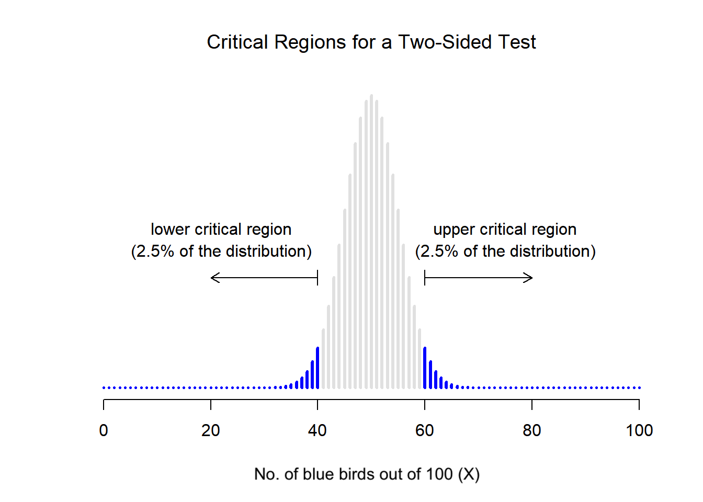

```{r, include=FALSE} 
#setup
options(htmltools.dir.version = FALSE)
knitr::opts_chunk$set(
  fig.width=9, fig.height=3.5, fig.retina=3,
  out.width = "100%",
  cache = FALSE,
  echo = TRUE,
  message = FALSE, 
  warning = FALSE,
  hiline = TRUE
)

#library(xaringanExtra)
#xaringanExtra::use_panelset()
```

```{r, include=FALSE, warning=FALSE} 
#xaringan-themer
library(xaringanthemer)
style_duo_accent(
  primary_color = "#FF3C38", #headers
  secondary_color = "#006C67", #bold inline #006C67, #011936
  inverse_header_color = "#FFB100", #FFFFFF
  colors = c(red = "#FF3C38",
           grey = "#003844",
           blue = "#1F85DE"),
  #text_font_size = "1.1rem"
)
```

class: title-slide center middle
background-image: url("img/hands.png")
background-position: right
background-size: contain
background-color: white

.pull-left[
# .red[`r rmarkdown::metadata$title`]

### .red[`r rmarkdown::metadata$author`]

### .red[`r rmarkdown::metadata$date`]
]

---
class: middle

```{css, echo=F}
   .large { font-size: 120% }
   .huge { font-size: 140% }
```

# How to use these materials

.large[
Go through the slides and discussion points together in your working group. 

Make sure everyone understands all the key points and concepts. Ask each other questions. Make a note of any questions you have for me &#x1f4dd;
]

---

# Today

<br>

```{css, echo=F}
    /* Table width = 100% max-width */

    .remark-slide table{
        width: 100%;
    }

    /* Change the background color to white for shaded rows (even rows) */

    .remark-slide thead, .remark-slide tr:nth-child(2n) {
        background-color: white;
    }
    
```

.pull-left[
```{r, echo = FALSE}
#schedule
library(kableExtra)
dt <- data.frame(schedule = c( # variables quiz
                              "Course intro", 
                              "Group activities", 
                              "Hypothesis testing", 
                              "Lunch (45 min)?",
                              "Significance and *p*-values",
                              "Reproducibility",
                              "Group activities",
                              "Check-in / update"),
                 time = c("11:30", 
                          "", 
                          "",
                          "",
                          "14:00",
                          "", "", "16:30"))
kbl(dt, align=c("l","c")) %>%
  kable_styling(bootstrap_options = "striped", full_width = T, position = "left")

# Slides
```
.footnote[*Timing is flexible and up to you. Take breaks when you want]
]

--

.pull-right[
<center></center>

]

---
class: middle

```{css, echo=F}
   .large { font-size: 120% }
```

# About this course

.large[
The course focuses on **statistical hypothesis testing** and **reproducibility** in science. 

You will learn:
* how develop and test hypotheses
* perform basic statistical tests 
* apply this knowledge to reproduce (and potentially improve) published results
]

.large[Each participant is assigned to a working and each group is assigned a published scientific paper.]

---

.left-column[

.red[
### Group 1
]

<br>
<br>


.red[
### Group 2
]

<br>

.red[
### Group 3
]

<br>

.red[
### Group 4
]

]

.right-column[

.large[
[*Diversity and faunal changes in the latest Cretaceous dinosaur communities of southwestern Europe*](https://www.sciencedirect.com/science/article/abs/pii/S0195667115300264?casa_token=0WvECdAuP4QAAAAA:Pc1O77s9JVCTG6m7IGpV2Q5JTD7PADtqCI_LzB0SF_wpXKH9rpZdS7WUBcvbyeUJl2Ia40hSbA)
]

<br>
<br>

.large[
[*Macroevolutionary trends in theropod dinosaur feeding mechanics*](https://doi.org/10.1016/j.cub.2021.11.060)
]

<br>
<br>

.large[
[*The locomotor ecomorphology of Mesozoic marine reptiles*](https://onlinelibrary.wiley.com/doi/10.1111/pala.12645)
]

<br>
<br>

.large[
[*Walking like dinosaurs: chickens with artificial tails provide clues about non-avian theropod locomotion*](https://journals.plos.org/plosone/article?id=10.1371/journal.pone.0088458)
]

]


---

<br>
<br>
<br>
<br>

# Course evaluation

.large[The goal is to reproduce the statistical results of a published scientific article.]

--

.large[On **09 May 14:00-16:00** each group will present their findings.]

--

.large[You can use this [*Google Slides Template*](https://docs.google.com/presentation/d/1R_p1v3kD2eWrfU0uOmbvyE4iP0YD2_KRqfAuxwOLSMg/edit?usp=sharing) to prepare your presentation.]

--

.large[Within your group, make as much progress as you can today.]

---
<br>
<br>
<br>
<br>

# Will I have to use R?

--

.large[Not necessarily.]

--

.large[The focus is on the **concepts** behind statistical hypothesis testing and reproducibility, not programming, but both things are (probably) easier if you use R.]

--

.large[It's up to each group how you divide the tasks.]

---

background-image: url("img/fully-expecting.jpeg")
background-size: contain
class: middle


```{r, echo=FALSE}
#--
# Many students don't enjoy learning about statistics $-$ I know, because I used to be one!
# I hope not
```

---
class: middle inverse

.pull-left[

<br>
<br>

.center[
## I'm here to help!
]

]


.pull-right[
<center></center>
]

---
class: middle

.pull-left[
```{r, out.width = '100%', echo = FALSE}
# local
knitr::include_graphics("img/fossil.png")
```
]

.pull-right[
# Why does paleobiology involve so much statistics?
.large[What do you think? &#129300;]
]


```{r, echo=FALSE}
#.large[
#* Why is it not sufficient just to have a research objective or question? 
#* Why can't we just collect observations and describe those in our papers?
#]
```
```{css, echo=F}
    .my-one-page-font {
      font-size: 35px;
      color: darkslategray;
    }
```
---
class: middle
# Discussion

.pull-left[

.large[**Group exercise**]

In your working group, introduce yourselves, and consider the following:

* Why do we need statistics?
* What is your experience using statistics so far?
* Can you think of scenarios where statistics might be useful or important?

]

.pull-right[
```{r, echo=FALSE}
countdown::countdown(
  minutes = 10, 
  seconds = 0, 
  warn_when = 8,
  style = "position: relative; width: min-content; margin: 1em auto;",
  #color_running_background = "#31b09e",
  color_warning_background = "#f79334",
  #color_finished_background = "#b56b6f",
  #color_finished_text = "#eaeaea"
)
```
]


---

class:my-one-page-font

```{r, out.width = '15%', fig.align = 'right', echo = FALSE}
# local
knitr::include_graphics("img/wiki.png")
# https://www.science.org/doi/epdf/10.1126/science.1218685
```

Statistics is the science of learning from data - *"the discipline that concerns the collection, organization, analysis, interpretation, and presentation of data"*

Also known as, *"the science of uncertainty"*

---

<br>
<br>
<br>

# Why study statistics?

.large[
* Humans are **biased** and probabilities are **unintuitive**
]

--

.large[
* Living systems are **complicated** and data is **messy**
]

--

.large[
* It is deeply intertwined with **research design**
]

--

.large[
* Where there's **data** there's statistics! → It makes the **literature** more accessible
]

--

.large[
* Having some knowledge of statistics gives you a **superpower** &#x1F9B8;
]
--

.large[
* Did you think of anything else?
]

```{r, echo=FALSE}
# We need to be able to build trust in our discoveries
# There aren't universal truths, like there are in physics
# Results can be unexpected or counter intuitive
```
---
class: middle
# Mini reading group

.pull-left[
.large[**Group exercise**]

In your working groups, discuss the following:

* What is your paper about?
* What was the general aim?
* What were the study's findings?
* What did you like / not like?

For later: prepare a three sentence summary &#x1f4dd;

]

.pull-right[
```{r, echo=FALSE}
countdown::countdown(
  minutes = 20, 
  seconds = 0, 
  warn_when = 120, 
  style = "position: relative; width: min-content; margin: 1em auto;",
  #color_running_background = "#31b09e",
  color_warning_background = "#f79334",
  #color_finished_background = "#b56b6f",
  #color_finished_text = "#eaeaea"
)
```
]
---
class: middle center

<center></center>

# .black[Take a break if you need one]


---
class: middle
background-image: url("img/noahs-ark.jpg")
background-size: contain
background-position: right
name: hypothesis

.pull-left[
# Introduction<br> to statistical<br> hypothesis<br> testing</p>

]

---
background-image: url("img/noahs-ark.jpg")
background-size: contain
background-position: right

<br>
<br>
<br>

.pull-left[
# Objectives

.large[
* Research hypotheses vs. statistical hypotheses

* Null vs. alternative hypotheses

* Sampling distributions

* Significance and *p*-values
]

.footnote[Further reading [*Learning Statistics with R*](https://learningstatisticswithr.com/book/)]

]
---
background-image: url("img/Scientific-Method-Steps.webp")
background-size: contain
background-position: right
class: middle

.pull-left[

# Hypotheses testing is an integral part of the scientific method

]

---
background-image: url("img/foram.gif")
background-size: contain
background-size: 15%
background-position: 90% 10%

<br>
<br>
<br>

# Example

.huge[&#x1f4cc; *Can we detect climate shifts using changes in foram species ratios?*]

<br>
.large[
Foraminifera are single-celled marine protists. Some species thrive in **.blue[cool waters]**, while others prefer **.red[warm waters]**. By analysing changes in the  relative abundance of **.blue[cool]** vs. **.red[warm]** water species, we can infer past climate fluctuations.
]

---
background-image: url("img/foram.gif")
background-size: contain
background-size: 15%
background-position: 90% 10%

<br>
<br>
<br>

# Example

.large[Say we have a sample that comprises two foram species - one prefers **.blue[cool water]**, the other prefers **.red[warm water]**. We might want to test, has the climate  shifted over time? Our research hypothesis might be that it *has*.]

<br>
--

.large[Evidence for this might come from the frequency of each species, allowing us to make statements like the following.]

--

.large[
* The proportion of **.blue[cool water]** species has remained the same.
]

.large[
* The proportion of **.blue[cool water]** species has changed (increased or decreased). 
]

---
background-image: url("img/foram.gif")
background-size: contain
background-size: 15%
background-position: 90% 10%

<br>
<br>
<br>

# Example

.large[Let's formalise these statements as statistical hypotheses. θ = the probability of being a **.blue[cool water]** species.
]

--

.large[* In our example, during a stable cool period, we expect 50% of the forams to be **.blue[cool water]** species. In this case, θ = 0.5.
]

--

.large[
* If more individuals are **.blue[cool water]** species, θ > 0.5.
]

--

.large[
* If more individuals are **.red[warm water]** species, θ < 0.5.
]

```{r, echo=FALSE}
# * If I know a different number of birds are blue than are red, but I didn’t keep my field notes well organised, I might not know which way round the numbers go. Then, $θ \neq$ 0.5.
# In other words, an individual sampled at random has a 50% chance of being a **.blue[cool water]** species. 
```

---
background-image: url("img/foram.gif")
background-size: contain
background-size: 15%
background-position: 90% 10%

<br>
<br>
<br>

## Example

.large[These precise mathematical statements are examples of **statistical hypotheses**.]

--

.large[
* The **research hypothesis** $-$ the climate has shifted
]

.large[
* The **statistical hypothesis** $-$ θ > 0.5
]

--
.large[
&#9888;&#65039; A statistical hypothesis (or test) is a *test of the statistical hypothesis*, not the research hypothesis!
]

---

<br>
<br>
<br>

# Null vs. alternative hypotheses 

.large[
The **null hypothesis** $H_0$ is a concise statement expressing the concept of "no difference" between a sample and some expected value.

It corresponds to the exact opposite of the thing we're testing!
]

--

.large[
The **alternative hypothesis** $H_1$ is the thing we're actually interested in testing.
]

--

.large[
The goal is not to show that the alternative hypothesis is true, the goal is to show that the null hypothesis is (probably) false!
]

```{r, echo=FALSE}
#the null hypothesis is deemed to be true unless you, the researcher, can prove beyond a reasonable doubt that it is false.
```
---
background-image: url("img/foram.gif")
background-size: contain
background-size: 15%
background-position: 90% 10%

<br>
<br>
<br>

# Example

.large[
* **Null hypothesis** $-$ θ = 0.5, i.e., the proportion of **.blue[cool water]** species has not changed.
]

.large[
* **Alternative hypotheses** $-$ θ > 0.5 or θ < 0.5, i.e., the proportion of **.blue[cool water]** species *has* changed.
]

--
.large[
The null hypothesis is what we'd except if there was no change from a stable cool period. Using a binomial test, we can check whether the observed frequency deviates significantly from the expected proportion (more on this shortly). 

Evidence in favour of the alternative hypotheses would provide evidence that the climate had shifted.
]

---
class: middle
# Discussion 

.pull-left[
.large[**Group exercise**]

Discuss the following concepts before moving on:

* Research vs. statistical hypothesis
* Null vs. alternative hypothesis
* Why do we aim to show that the null hypothesis is false, and not that the alternative hypothesis is true?

]

.pull-right[
```{r, echo=FALSE}
countdown::countdown(
  minutes = 10, 
  seconds = 0, 
  warn_when = 8, 
  style = "position: relative; width: min-content; margin: 1em auto;",
  #color_running_background = "#31b09e",
  color_warning_background = "#f79334",
  #color_finished_background = "#b56b6f",
  #color_finished_text = "#eaeaea"
)
```
]

---
name: significance
<br>
<br>
<br>

# Sampling distributions

.large[
If the probability of being a **.blue[cool water]** species is θ = 0.5, what would we expect the data to look like? 
]

--

.large[
We can also write $X/N$ = 0.5. This is our **test statistic**.
] 

--

.large[
We need to determine what the **sampling distribution** of the test statistic would be if the null hypothesis was true. This tells us what values we can expect. We use this a tool to assess how closely the null agrees with our data.
]

--
.large[The frequency of a given species in our sample can be represented using a binomial distribution, where the values are the expected **.blue[cool water]** proportion.]

---

class: middle

<center></center>

The null hypothesis predicts that $X$ is [*binomially distributed*](https://en.wikipedia.org/wiki/Binomial_distribution).
It says $X$ = 50/100 is the most likely outcome, so we'd expect to see somewhere between 40 and 60 **.blue[cool water]** species.

---

<br>
<br>
<br>

## Critical regions and critical values

.large[
$X$ should be very big or very small in order to reject the null hypothesis.]

--

.large[
If the null hypothesis is true, the sampling distribution of $X$ is Binomial $(0.5, N)$.
]

--

.large[
$\alpha$ is the significance level (c.f. *p*-values).
]

--

.large[
If $\alpha = 0.05$, the critical region must cover 5% of this sampling distribution.
]

---
class: middle center

<center></center>

Our critical region consists of the most extreme values, known as the **tails** of the distribution.

---
class: middle

.pull-left[

<br>
<br>
<br>

.large[
The **critical region** corresponds to the values of $X$ for which we would reject the null hypothesis. 

The **sampling distribution** allows us to calculate the probability that we would obtain a given value of $X$ if the null hypothesis were true.
]
]

.pull.right[


]

---
class: middle

.pull-left[

.large[
For $\alpha =$ .05, our critical regions correspond to  $X ≤$ 40 and $X≥$ 60.

The numbers 40 and 60 are our **critical values**.

If the number of **.blue[cool water]** species is between 41 and 59, then we should retain the null hypothesis.

If the number of **.blue[cool water]** species is between 0 to 40 *or* between 60 to 100, then we can reject the null hypothesis $-$ this is a **two tailed test**.
]
]

.pull.right[

]

---
class: middle
background-image: url("img/CriticalRegion.png")
background-size: 100%
background-position: centre

---
class: middle center

<center></center>

The critical region for a **one sided test**. We would use this to test for $θ >$ 0.5 (i.e, more specis that expected are **.blue[cool water]** species).

---

<br>
<br>
<br>

# Statisical significance

.large[
If the data allow us to reject the null hypothesis, we say that "the result is statistically significant", which is often shortened to "the result is significant". 

This terminology reflects a time when "significant" meant something like "indicated", rather than its more recent meaning, which is closer to "important".
]

--
.large[
How do we define significance?
]
---
<br>
<br>
<br>

# Two types of errors

.large[
We **always** have to accept there's a chance that the results of any test might be wrong.]

--

.large[
The goal behind statistical hypothesis testing is not to *eliminate* but to *minimize* errors.
]

---
<br>
<br>
<br>

# Two types of errors

.large[
After we run the test, one of four things might have happened:

* $H_0$ is **true** and we *correctly accept* the null

* $H_0$ is **true** and we *incorrectly reject* the null (type I error)

* $H_0$ is **false** and we *correctly reject* the null

* $H_0$ is **false** and we *incorrectly accept* the null (type II error)
]

---
<br>
<br>
<br>

# Two types of errors

.large[
If we reject a null hypothesis that is actually true, then we have a **type I error**.
]

--

.large[
If we retain the null hypothesis that is actually false, then we have a **type II error**.
]

--

.large[
One of the most important aspects of hypothesis testing is to control the probability $\alpha$ of a **type I error**. ]

--

.large[
$\alpha$ is called the significance level. By convention we often use $\alpha$ of 0.05, 0.01, 0.001.]

--

.large[
A hypothesis test that is said to have a significance level $\alpha$, has a type I error rate is no larger than $\alpha$.
]


---
background-size: contain
background-size: 10%
background-position: 90% 5%

# *p*-values

.pull-left[

.large[
*p* can be defined to be the smallest type I error rate $\alpha$ that you are willing to tolerate if you want to reject the null hypothesis.

In the foram example, $X=$ 62 **.blue[cool water] species** gives us 
*p* = 0.021. The results can be interpreted as shown in the table, given *p* = 0.021.

$X=$ 97 **.blue[cool water]** species would give us *p* = 1.36 X $10^{-25}$, which is a tiny, tiny type I error rate.

]

.footnote[*p* can be calculated in R or looked up in a statistical table.]

]

.pull-right[
<br>
<center></center>
]

---
# *p*-values

.pull-left[

.large[

Recall that the critical region corresponds to the tails (extremes) of the distribution. 

*p* can therefore also be defined as the probability of observing a test statistic that is (at least) as extreme as the one we actually get. 

If the data are extremely implausible according to the null hypothesis, then the null hypothesis is probably wrong.

]

.footnote[*p* can be calculated in R or looked up in a statistical table.]

]

.pull.right[

<center></center>
]

---
class: middle
background-image: url("img/P-values.jpg")
background-size: contain
background-position: centre

---
<br>
<br>
<br>

# Reporting *p*-values

.large[
**Option 1** $-$ you can state only that *p* $< \alpha$ for a significance level that you chose in advance, e.g., *p<*.05.

But this means we're being forced to treat *p*=.051 in a fundamentally different way to *p*=.049.]

--

.large[
**Option 2** $-$ just report the actual *p* value and let the reader make up their own minds about what an acceptable type I error rate is.

But if you get *p=*.062, then it means that you have to be willing to tolerate a type I error rate of 6.2% to justify rejecting the null. If you personally find 6.2% intolerable, then you retain the null.
]

---
<br>
<br>
<br>

# Two types of errors

<br>

.large[
What about type II error rate? We care about this probability $\beta$ too. 


We refer to the **power** of the test, which is the probability that we reject the null hypothesis when it really is false, which is $1 - \beta$. 


A powerful test has a small value of $\beta$. Note we don't have a corresponding level for $\beta$. Statistical tests are designed to minimise $\alpha$, not $\beta$.]

---
class: middle
# Discussion 

.pull-left[
.large[**Group exercise**]

Discuss the following concepts before moving on:

* Type I errors
* Type II errors
* Why is the goal of hypothesis testing to minimise type I - not type II - errors?

]

.pull-right[
```{r, echo=FALSE}
countdown::countdown(
  minutes = 10, 
  seconds = 0, 
  warn_when = 8, 
  style = "position: relative; width: min-content; margin: 1em auto;",
  #color_running_background = "#31b09e",
  color_warning_background = "#f79334",
  #color_finished_background = "#b56b6f",
  #color_finished_text = "#eaeaea"
)
```
]
---

class: middle center

<center></center>

# .black[Take a break if you need one]
---
<br>
<br>
<br>

# Which statistical test should you use?

.large[

All statistical tests follow the same principles shown in previous slides but vary in the underlying details. You don't usually need to remember these.

Important things to consider when choosing a test: 
  * the type of data (variables) you have
  * what you're trying to test (e.g., comparison, correlation)
  * the assumptions the test makes about your data
]

.footnote[Further reading [*Choosing the Right Statistical Test*](https://www.scribbr.com/statistics/statistical-tests/)]

---
class: middle
background-image: url("img/cont_discrete.png")
background-size: contain
background-position: centre
---
class: middle
background-image: url("img/nom_ord_bin.png")
background-size: contain
background-position: centre
---
class: middle
# Data 

.pull-left[
.large[**Group exercise**]

Discuss the following:

* Data types
  * categorical vs. numerical
  * nominal vs. ordinal
  * discrete vs. continuous

* Can you think of an example of each one?
* What types of data are used for statistics in your paper? Make a note &#x1f4dd;

]

.pull-right[
```{r, echo=FALSE}
countdown::countdown(
  minutes = 10, 
  seconds = 0, 
  warn_when = 8, 
  style = "position: relative; width: min-content; margin: 1em auto;",
  #color_running_background = "#31b09e",
  color_warning_background = "#f79334",
  #color_finished_background = "#b56b6f",
  #color_finished_text = "#eaeaea"
)
```
]
---
<br>
<br>
<br>

# Places to look to learn more about individual tests

.large[* Nice overview: [*Choosing the Right Statistical Test*](https://www.scribbr.com/statistics/statistical-tests/)]

.large[* YouTube, I'm a big fan of [@zedstatistics](http://www.zstatistics.com/videos) but there are many others]

.large[* AI tools can provide great explanations of basic tests]

.large[* Consider taking a [Coursera Course](https://www.coursera.org/learn/basic-statistics)]

.large[* I can walk through some specific tests next time]
---
class: middle
# Published hypotheses

.pull-left[
.large[**Group exercise**]

Try to identify the following in your paper:
* The research hypothesis
* Statistical tests
* The alternative hypothesis
* The null hypothesis
* Do you agree with the authors?

Make a note to add your presentation &#x1f4dd; 

Don't worry about getting it perfect, you can make refinements later as you learn more about the tests.

]

.pull-right[
```{r, echo=FALSE}
countdown::countdown(
  minutes = 15, 
  seconds = 0, 
  warn_when = 12, 
  style = "position: relative; width: min-content; margin: 1em auto;",
  #color_running_background = "#31b09e",
  color_warning_background = "#f79334",
  #color_finished_background = "#b56b6f",
  #color_finished_text = "#eaeaea"
)
#If your paper includes more than one, just pick one.
```
]

---
class: middle
# Intepreting *p*-values

.pull-left[
.large[**Group exercise**]

* How have the authors of your paper reported the *p* values? (if any)
* How have the authors interpreted the *p* values?
* Do you agree with them?

Make a note to add your presentation &#x1f4dd; 

]

.pull-right[
```{r, echo=FALSE}
countdown::countdown(
  minutes = 10, 
  seconds = 0, 
  warn_when = 8, 
  style = "position: relative; width: min-content; margin: 1em auto;",
  #color_running_background = "#31b09e",
  color_warning_background = "#f79334",
  #color_finished_background = "#b56b6f",
  #color_finished_text = "#eaeaea"
)
```
]

---
class: middle center
<center></center>

# .black[End of Part 1]

```{r, eval=FALSE, echo=FALSE}
renderthis::to_pdf("part-01.Rmd",complex_slides = TRUE)
```
